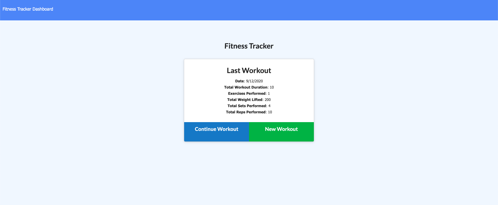

# Fitness Tracker 

## Description

This app allows the user to enter and exercise and track their workouts on their dashboards

## Table of Contents

 <!--ts-->

- [Installation](#Installation)
- [Usage](#Usage)
- [License](#License)

<!--te-->

## Installation

Installation requirements:

- node
- mongoose
- mongodb
- nodemon
- express

## Usage

Follow the link below to the deployed site and enter the workouts that you would like to track and view them on the dashboard page when you click the dashboard tab.

### Link Deployed Site

-https://workoutandfitness.herokuapp.com/

#### SnapShots

## License

The chosen license for this application is MIT. Please follow the link below for more imformation about the license.

- https://opensource.org/licenses/MIT

###
Copyright 2020 Cyrus Jose

Permission is hereby granted, free of charge, to any person obtaining a copy of this software and associated documentation files (the "Software"), to deal in the Software without restriction, including without limitation the rights to use, copy, modify, merge, publish, distribute, sublicense, and/or sell copies of the Software, and to permit persons to whom the Software is furnished to do so, subject to the following conditions:

The above copyright notice and this permission notice shall be included in all copies or substantial portions of the Software.

THE SOFTWARE IS PROVIDED "AS IS", WITHOUT WARRANTY OF ANY KIND, EXPRESS OR IMPLIED, INCLUDING BUT NOT LIMITED TO THE WARRANTIES OF MERCHANTABILITY, FITNESS FOR A PARTICULAR PURPOSE AND NONINFRINGEMENT. IN NO EVENT SHALL THE AUTHORS OR COPYRIGHT HOLDERS BE LIABLE FOR ANY CLAIM, DAMAGES OR OTHER LIABILITY, WHETHER IN AN ACTION OF 